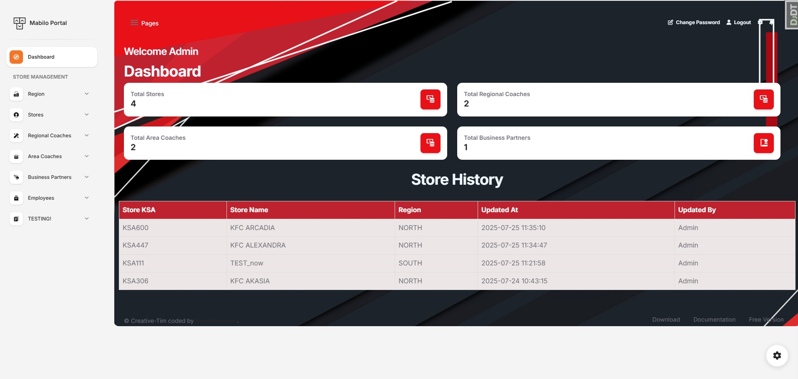

# [Django Soft Dashboard PRO](https://app-generator.dev/product/soft-ui-dashboard-pro/django/)

**Django** starter styled with **[Soft Dashboard PRO](https://appseed.us/product/soft-ui-dashboard-pro/django/)**, a premium `Bootstrap 5` KIT from `Creative-Tim`.
The product is designed to deliver the best possible user experience with highly customizable feature-rich pages. 

- 👉 [Django Soft Dashboard PRO](https://app-generator.dev/product/soft-ui-dashboard-pro/django/) - `Product Page`
- 👉 [Django Soft Dashboard PRO](https://django-soft-dash-pro.onrender.com/) - `LIVE Demo` 
- 👉 [Django Soft Dashboard PRO Documentation](https://app-generator.dev/docs/products/django/soft-ui-dashboard-pro/index.html) - `Complete Information` and Support Links
  - [Getting Started with Django](https://app-generator.dev/docs/technologies/django/index.html) - a `comprehensive tutorial`
  - `Configuration`: Install Dependencies, Prepare Environment, Setting up the Database 
  - `Start with Docker`
  - `Manual Build`
  - `Start the project`
  - `Deploy on Render`

 

## Files in use
- apps
  - db
  - models
  - pages
    - admin
    - forms
    - models
    - urls
    - views
    - views_area_coach
    - views_business_partner
    - views_employees
    - views_regional_coach
    - views_regions
    - views_stores
    - views_testing
 

  - static
    - assets
      - css
      - img

  - templates
    - ## pages
      - ## pages
        - ## add_records
            - add_area_coach.html
            - add_business_partner.html
            - add_employee.html
            - add_region.html
            - add_regional_coach.html
            - add_store.html
          
            - ## assignments
              - ac_assignments.html
              - add_ac_assignments.html
              - ad_bp_asignments.html
              - add_rc_assignments.html
              - bp_asignments.html
              - rc_assignments.html

        - ## edit_records
          - edit_ac.html
          - edit_aca.html
          - edit_bp.html
          - edit_bpa.html
          - edit_rc.html
          - edit_rca.html
          - edit_regions.html
          - edit_stores.html
      
        - ## testing
          - test.html
          - test_table.html
        - area_coaches.html
        - business_partners.html
        - employees.html
        - region_table.html
        - regional_coaches.html
        - stores.html
        

## Features

- ## Dashboard 

- ## Regions
  -  View Regions
  - Add Regions
 

- ## Stores
  - View stores
  - View Stores

  
- ## Regional Coaches
  - View Coaches
  - Add Coaches
  - View Assignments
  - Add Assignments

  
- ## Area Coaches
  - View Coaches
  - Add Coaches
  - View Assignments
  - Add Assignments
 

- ## Business Partners
  - View Partners
  - Add Partners
  - View Assignments
  - Add Assignments

- ## Employees
  - still in testing

- ## Testing
  - Test view of staff assigned to Store, by clicking store name, prints to console 

  

---
